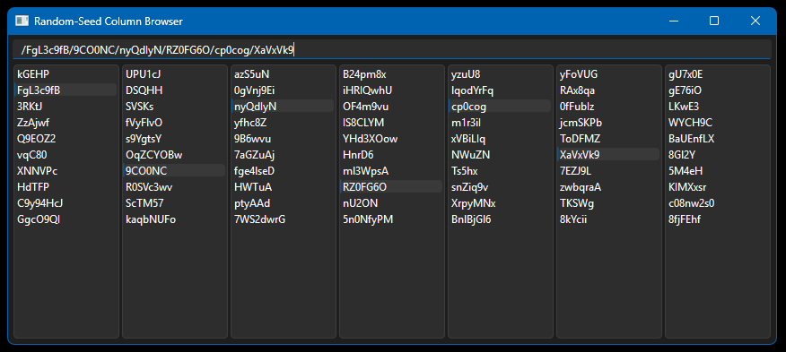
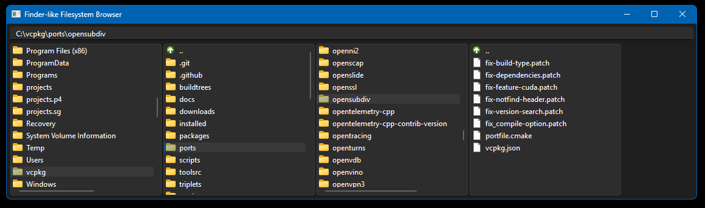

# Finder4

PySide6 "Finder" widgets: display any set of nested data (think filesystems) in a neat multicolumn view.
The whole thing is a quick proof of concept for various compact path browsers (Asset, packages, any generic data browsers).

Example below shows function generating pseudorandom data as a dataset to browse, tracking the path in the top line edit. Settings are saved on exit, so you start with the same path again:

This example shows the same behavior just on a filesystem:

